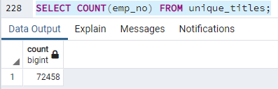
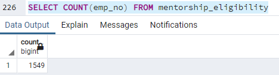

# Pewlett Hackard Analysis

## Overview

The purpose of this analysis was to gain insight into the demographics of employees at Pewlett Hackard using SQL queries.

## Results

- Pewlett Hackard will soon be experiencing a wave of retirements (AKA a "silver tsunami") as employees reach retirement age
- Over 50,000 people in senior positions (Senior Engineer or Senior Staff) are of retirement age
- Only 2 managers are of retirement age
- The silver tsunami will have the greatest impact at the senior position level
  - This is somewhat predictable given people in senior positions with greater experience tend to be older than their subordinates

## Summary
 

 
If all employees of retirement age were to retire as part of the silver tsunami, 72,458 positions would need to be filled. This is an incredibly large number and will likely necessitate swift action from Pewlett Hackard.

With only 1,549 employees eligible to act as mentors, Pewlett Hackard is not sufficiently equipped to mentor its next generation of employees.
