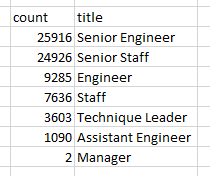

# Pewlett Hackard Analysis

## Overview

The purpose of this analysis was to gain insight into the demographics of employees at Pewlett Hackard using SQL queries.

## Results

- Pewlett Hackard will soon be experiencing a wave of retirements (AKA a "silver tsunami") as employees reach retirement age
- Over 50,000 people in senior positions (Senior Engineer or Senior Staff) are of retirement age
- Only 2 managers are of retirement age
- The silver tsunami will have the greatest impact at the senior position level
  - This is somewhat predictable given people in senior positions with greater experience tend to be older than their subordinates

## Summary
 
